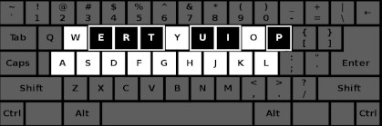

# Emergency-version

**Disadvantages**
  - It is monophonic only.
  - Does not sound as good.
  - Hmmmm, latency. If you need a large blocksize.

**Advantages**
  - It can be recorded with audacity and the like.
  - Probably works on all computers.

This one uses sounddevice instead of simpleaudio.
It uses a callback function that streams zeros if no key
has been pressed.



### dependences

```
pip3 install numpy
pip3 install sounddevice
```
Also tkinter.

```
sudo apt-get install python-tk
```
