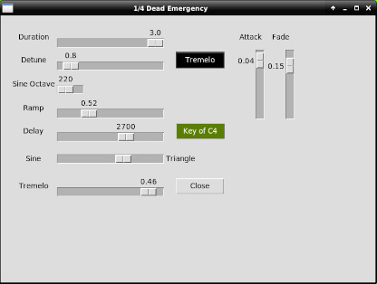

# quarter-dead-synth

### A bit of a synthesizer you can play on your computer keyboard.

I called it quarter dead because that was the first tune that popped out
of my fingers after I tapped a key and heard the first note. It uses
simpleaudio, its a fantastic package, I just discovered it.
You need at least python 3.7 to use it.  
Also numpy, and tkinter for the GUI.
The quarter-dead-synth has detune functionality, Switch between two octaves.
Adjustable FM modifying ramp intensity.
You can swing between sine and triangle waves.
Switch just the sine between two octaves.
And, switch between monophonic and polyphonic.
There is a delay slider to
delay the left channel but, -there is a surprise!


## python3.7 +

### Linux prerequisites for simpleaudio

```
sudo pip3 install --upgrade pip setuptools
```
```
sudo apt-get install -y python3-dev libasound2-dev
```

### dependences

```
pip3 install numpy
pip3 install simpleaudio
```
Also tkinter.

```
sudo apt-get install python-tk
```


**Note:- This is a quick and dirty orrible synth and not all computers are going
to deliver the goods in pristine condition. If this is the case,
try the [Emergency-version](Emergency-version/) pictured below.**



I have tried both versions on a dell laptop with a
dual core pentium running Debian on which it worked perfectly with no perceptible latency, however,
on my daughters ryzen3 gaming computer running Mint, quarter_dead_e.py was a disaster and
Emergency-version had a bit of latency.

Listen to these synths on this video : [https://youtu.be/WFZZJfIEdT4](https://youtu.be/WFZZJfIEdT4).

This project features on my webpage, the link is [here](https://pythonaudiosynthesisbasics.com/two.html),
but you must only visit at midnight.
