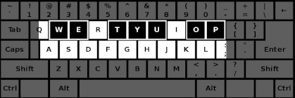

# quarter-dead-synth

### A bit of synth you can play on your computer keyboard.

I called it quarter dead because that was the first tune that popped out
of my fingers after I tapped a key and heard the first note. It uses
simpleaudio. Its a fantastic package, I just discovered it. I am pretty
sure you need at least python 3.7 to run it, but its diamond. 
There is detune functionality, Switch between two octaves.
Adjustable FM modifying ramp intensity. There is a delay slider to
delay the left channel but, -there is a surprise!

There is the original version in C4.



Or the "quarter_dead_e" in E4 with
added functionality. You can swing between  sine and triangle waves.
Switch just the sine between two octaves so you can play two octaves
simultaneously.
And, switch between monophonic and polyphonic.


## python3.7

### Prerequisites for simpleaudio

```
sudo pip3 install --upgrade pip setuptools
```
```
sudo apt-get install -y python3-dev libasound2-dev
```

### dependences

```
pip3 install numpy
pip3 install simpleaudio
```
Also tkinter.

```
sudo apt-get install python-tk
```
